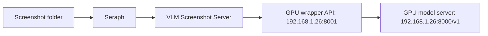
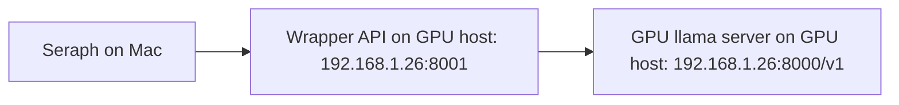

# VLM Screenshot Server

Dockerized LAN/local screenshot analysis service for Seraph, Framekeeper output folders, or any app that wants to send screenshots to a private vision-language model.

The service does not take screenshots. It only accepts image bytes and forwards them to an OpenAI-compatible VLM endpoint such as vLLM, SGLang, llama.cpp server, LM Studio, or an Ollama-compatible proxy.

## Target Setup

- Seraph runs on your Mac/Linux workstation.
- This wrapper runs as a Dockerized HTTP API on the GPU host.
- The GPU model server runs on the same GPU host behind the wrapper.
- Seraph communicates with the wrapper through HTTP API calls. SSH is for GPU host administration, deployment, and logs only; it is not the product runtime path.



## Quick Start

### Recommended Seraph Topology

Run the GPU model server on the RTX 3090 Ti host and run this wrapper with Docker Compose on that same GPU host. The wrapper publishes `192.168.1.26:8001` to Seraph and forwards serial work to the GPU model backend at `http://192.168.1.26:8000/v1`.



On the GPU host, use the official Unsloth Gemma 4 QAT llama.cpp path. Build a CUDA llama.cpp, download the QAT GGUF and multimodal projector, then start the server:

```bash
git clone https://github.com/seraph-quest/vlm-screenshot-server.git
cd vlm-screenshot-server
./scripts/build-llama-cuda.sh
./scripts/download-gemma4-qat.sh
./scripts/run-gemma4-3090ti.sh
```

Equivalent explicit server command after the build/download steps:

```bash
$HOME/src/llama.cpp/llama-server \
  --model $HOME/models/gemma-4-26B-A4B-it-qat-GGUF/gemma-4-26B-A4B-it-qat-UD-Q4_K_XL.gguf \
  --mmproj $HOME/models/gemma-4-26B-A4B-it-qat-GGUF/mmproj-BF16.gguf \
  --host 0.0.0.0 \
  --port 8000 \
  --ctx-size 32768 \
  --n-gpu-layers 999 \
  --temp 1.0 \
  --top-p 0.95 \
  --top-k 64 \
  --alias unsloth/gemma-4-26B-A4B-it-qat-GGUF \
  --chat-template-kwargs '{"enable_thinking":false}'
```

This intentionally does not use `llama serve -hf ... --no-mmproj-offload`; that path made text generation fast but left screenshot vision requests around 75 seconds on the RTX 3090 Ti. The QAT path uses Unsloth's `UD-Q4_K_XL` model plus explicit `mmproj-BF16.gguf` with a CUDA-built `llama-server`.

On the GPU host:

```bash
cp .env.example .env
docker compose up -d --build
```

Expected `.env` values for this topology:

```env
HOST=0.0.0.0
PORT=8001
HOST_BIND=0.0.0.0
HOST_PORT=8001
VLM_BASE_URL=http://192.168.1.26:8000/v1
VLM_MODEL=unsloth/gemma-4-26B-A4B-it-qat-GGUF
VLM_TRUST_ENV=false
VLM_ALLOW_DOCKER_LOCALHOST=false
```

Health checks from the Mac or from Seraph:

```bash
curl http://192.168.1.26:8001/health
curl http://192.168.1.26:8001/health/backend
curl http://192.168.1.26:8001/queue/status
curl http://192.168.1.26:8001/health/chat \
  -H "Authorization: Bearer $CHAT_PROXY_API_KEY"
```

The wrapper container runs in Docker bridge mode and reaches the model server through the GPU host LAN address. Do not set the wrapper backend to `http://127.0.0.1:8000/v1` in this topology; inside bridge-mode Docker that points back at the wrapper container, not the GPU host.

Analyze a screenshot:

```bash
curl -F "file=@/path/to/screenshot.png" \
  http://192.168.1.26:8001/v1/analyze-file
```

Seraph should point at the wrapper API, not the raw GPU model server:

```env
SERAPH_SCREEN_ANALYSIS_PROVIDER=local-vlm
SERAPH_LOCAL_VLM_BASE_URL=http://192.168.1.26:8001
SERAPH_LOCAL_VLM_MODEL=unsloth/gemma-4-26B-A4B-it-qat-GGUF
```

### Native Wrapper Fallback

The native wrapper script is a fallback for debugging Docker Desktop networking or local Python issues. It is not the default Seraph topology.

```bash
./scripts/run-local-wrapper.sh
```

For gated model repos, set `HUGGING_FACE_HUB_TOKEN` in `.env` after accepting the model license.

## GPU Backend Examples

### vLLM

```bash
vllm serve google/gemma-4-12b-it \
  --host 0.0.0.0 \
  --port 8000 \
  --dtype auto \
  --max-model-len 8192 \
  --gpu-memory-utilization 0.90
```

### llama.cpp Server

For Gemma 4 QAT on RTX 3090 Ti, use the CUDA llama.cpp build and QAT runner from this repo:

```bash
./scripts/build-llama-cuda.sh
./scripts/download-gemma4-qat.sh
./scripts/run-gemma4-3090ti.sh
```

Set the wrapper to call it:

```env
VLM_BASE_URL=http://192.168.1.26:8000/v1
```

For this GPU-host Docker topology, the wrapper runs in bridge mode and reaches the GPU model server through the host LAN IP. Use localhost only for native/non-Docker wrapper runs or if the model server is inside the same container.

## Model Shortlist For RTX 3090 Ti 24 GB

This list is oriented toward screenshot analysis: OCR, UI understanding, layout, code/editor text, terminal output, browser pages, dashboards, and concise JSON extraction.

| Rank | Model | Fit posture | Why use it | Notes |
| --- | --- | --- | --- | --- |
| 1 | Gemma 4 26B-A4B Dynamic 4-bit / GGUF via Unsloth | Strong 24 GB candidate | Best Gemma-first target if the quantized runtime fits and quality is stable | Unsloth lists 26B-A4B GGUF 4-bit around 16 GB total memory and Dynamic 4-bit around 19.78 GB. |
| 2 | Gemma 4 12B, preferably QAT/Q4 when available in your runtime | Expected sweet spot | Strong Google multimodal model family, QAT/Q4 options, likely good quality/speed balance on 24 GB | Start here if 26B-A4B is too slow or unavailable. Use the exact current model ID from Google/Hugging Face/Kaggle. |
| 3 | MiniCPM-V 4.5 AWQ/GPTQ/GGUF | Strong practical fit | Excellent small VLM option with OCR/document focus and quantized releases | Best non-Gemma first comparison. |
| 4 | Qwen2.5-VL-32B-Instruct-AWQ | Tight but high quality | Strong OCR, UI/chart/document reasoning; official AWQ quantization | Try with lower context/resolution/concurrency. |
| 5 | GLM-4.1V-9B-Thinking | Practical fit | Good reasoning-style VLM around screenshot interpretation | May be slower/more verbose than needed. |
| 6 | InternVL3-14B-AWQ | Practical/tight fit | Strong open VLM family with quantized options | Good benchmark candidate if Qwen32 is too heavy. |
| Watch | Qwen3 3.6B / "Qwen 3.6" | Verify before using | Could be useful if a vision-capable checkpoint exists, but plain Qwen3 text models do not replace a VLM | Do not use for screenshot analysis unless the model card explicitly supports image inputs. |

## Current Benchmark Notes

Use these as research anchors, not marketing gospel. For Seraph, benchmark on your own screenshot corpus because UI/OCR quality is workload-specific.

- Google lists Gemma 4 as multimodal, with E2B/E4B efficiency models and 12B/26B/31B advanced reasoning models, and positions the family for cloud servers, laptops, phones, and personal computers.
- Google’s Gemma 4 QAT release notes describe quantization-aware trained checkpoints, Q4_0 artifacts, and runtime support across vLLM, SGLang, llama.cpp, Ollama, and LM Studio.
- Unsloth’s Gemma 4 page is important for 24 GB cards because it lists practical 4-bit/Dynamic 4-bit memory footprints, including Gemma 4 26B-A4B around the high-teens GB range.
- MiniCPM-V 4.5 is a strong small-model baseline for OCR/document-style work and has quantized variants.
- Qwen2.5-VL-32B-AWQ is the quality-stress test for a 24 GB card: likely better on hard screenshots, but more memory-sensitive.
- Qwen3/Qwen 3.6 should stay on the watchlist until the exact candidate is confirmed as a vision-language model. Text-only Qwen3 checkpoints are not suitable for screenshot analysis.

Sources checked June 30, 2026:

- [Gemma model page](https://deepmind.google/models/gemma/)
- [Gemma 4 QAT announcement](https://blog.google/innovation-and-ai/technology/developers-tools/quantization-aware-training-gemma-4/)
- [Unsloth Gemma 4 models](https://unsloth.ai/docs/models/gemma-4)
- [MiniCPM-V 4.5 model card](https://huggingface.co/openbmb/MiniCPM-V-4_5)
- [Qwen2.5-VL-32B-Instruct-AWQ](https://huggingface.co/Qwen/Qwen2.5-VL-32B-Instruct-AWQ)
- [GLM-4.1V-9B-Thinking](https://huggingface.co/zai-org/GLM-4.1V-9B-Thinking)
- [InternVL3-14B-AWQ](https://huggingface.co/OpenGVLab/InternVL3-14B-AWQ)

## Seraph Integration Shape

Seraph should call this service as a remote image analyzer:

```env
SERAPH_SCREEN_ANALYSIS_PROVIDER=local-vlm
SERAPH_LOCAL_VLM_BASE_URL=http://192.168.1.26:8001
SERAPH_LOCAL_VLM_MODEL=unsloth/gemma-4-26B-A4B-it-qat-GGUF
```

This repo intentionally keeps the screenshot producer separate from analysis: screenshots are just files or uploaded image bytes.

## API

### `POST /v1/analyze-file`

Multipart upload:

```bash
curl -F "file=@screen.png" http://192.168.1.26:8001/v1/analyze-file
```

Seraph may also send profile-control form fields:

```bash
curl \
  -F "file=@screen.png" \
  -F "runtime_profile=screenshot_fast" \
  -F "runtime_path=screenshot_image_analysis" \
  -F "priority=background" \
  -F "reasoning=off" \
  -F 'profile_options={"chat_template_kwargs":{"enable_thinking":false},"reasoning":false,"reasoning_format":"none"}' \
  http://192.168.1.26:8001/v1/analyze-file
```

For `runtime_profile=screenshot_fast` or `reasoning=off`, the wrapper normalizes Gemma channel markers such as `<|channel>thought` before returning/parsing the response. This proves that callers do not receive visible reasoning markers after gateway normalization; it does not prove the backend performed no internal reasoning.

### Queue and Backpressure

All backend model calls pass through a bounded priority queue before hitting the OpenAI-compatible GPU server. Default behavior favors interactive/chat traffic over background screenshot analysis:

```env
QUEUE_MAX_SIZE=8
QUEUE_WORKERS=1
QUEUE_BACKGROUND_WORKERS=1
QUEUE_ADMIT_TIMEOUT_SECONDS=1
QUEUE_RESULT_TIMEOUT_SECONDS=600
```

Priority order is `interactive`, `high`, `normal`, `background`, then `low`. With one GPU, set `QUEUE_WORKERS=1` so only one model call runs at a time. `QUEUE_BACKGROUND_WORKERS=1` lets background screenshot work use that single worker when no higher-priority work is ready; active work is not preempted, and the next dispatch chooses by priority. If the queue is full of lower-priority work, a higher-priority request can preempt queued lower-priority work instead of being rejected. This keeps Seraph chat/report requests from being starved by a large screenshot backlog. If no lower-priority item can be preempted before `QUEUE_ADMIT_TIMEOUT_SECONDS`, the wrapper returns HTTP 429 with queue status. If a queued request waits/runs longer than `QUEUE_RESULT_TIMEOUT_SECONDS`, it returns HTTP 504.

### `GET /queue/status`

Returns operator-safe queue telemetry without probing the model backend:

```bash
curl http://192.168.1.26:8001/queue/status
```

The payload includes queued work, active work, active background work, pending queued labels, max queue size, effective worker counts, configured worker counts, and queue timeout settings. Seraph uses this surface for backpressure and operator-visible receipts.

### `GET /health/chat`

Returns chat-proxy readiness without running inference or adding GPU queue work:

```bash
curl http://192.168.1.26:8001/health/chat \
  -H "Authorization: Bearer $CHAT_PROXY_API_KEY"
```

The payload includes `enabled`, `auth_configured`, `auth_ok`, `status`, and `model`, but never returns the configured API key. Seraph uses this endpoint to prove the direct API route can use the chat proxy before marking the local Gemma/VLM path reachable. A healthy response has `status: "ok"` and `auth_ok: true`; `disabled`, `auth_not_configured`, or `auth_failed` means screenshot analysis may still work but Seraph chat is not ready.

### `POST /queue/clear`

Clears only queued work that has not started running:

```bash
curl -X POST http://192.168.1.26:8001/queue/clear
```

The running GPU job is not cancelled. Cleared queued non-streaming callers receive HTTP 409 with `vlm_queue_cleared`; queued streaming callers receive a terminal SSE error event with the same error code because streaming response headers may already be committed. The response includes the refreshed queue status plus `cleared`.

### `POST /v1/chat/completions`

OpenAI-compatible chat forwarding is disabled by default. Enable it only for Seraph local LLM routing on localhost or a private network:

```env
CHAT_PROXY_ENABLED=true
CHAT_PROXY_API_KEY=use-a-local-secret
```

Seraph must send the same value as `LOCAL_LLM_API_KEY`. The same screenshot-fast marker normalization is applied when request metadata or `X-Seraph-*` headers identify the request as `screenshot_fast` / `reasoning=off`.

Authenticated OpenAI-compatible streaming is supported with `stream: true`. The wrapper returns `text/event-stream` chunks from the backend directly to the caller and keeps the request inside the priority queue worker until the stream finishes or the caller disconnects, so a single-worker GPU deployment remains serial while still streaming tokens to Seraph:

```bash
curl -N http://192.168.1.26:8001/v1/chat/completions \
  -H "Content-Type: application/json" \
  -H "Authorization: Bearer $CHAT_PROXY_API_KEY" \
  -d '{"model":"unsloth/gemma-4-26B-A4B-it-qat-GGUF","stream":true,"messages":[{"role":"user","content":"Hello"}],"max_tokens":64}'
```

### `POST /v1/analyze`

JSON body:

```json
{
  "image_base64": "iVBORw0KGgo...",
  "media_type": "image/png",
  "app_hint": "VS Code"
}
```

Response:

```json
{
  "provider": "openai-compatible-vlm",
  "model": "google/gemma-4-12b-it",
  "duration_ms": 1234,
  "analysis": {
    "activity": "coding",
    "app_guess": "VS Code",
    "project": "seraph",
    "summary": "Editing a screenshot analysis provider.",
    "visible_text": ["redacted or short snippets"],
    "sensitive": false,
    "confidence": 0.86
  },
  "raw_text": "{...}"
}
```

## Privacy

- This service does not persist images.
- Raw screenshots are forwarded to the configured VLM backend.
- Put the VLM backend on a private LAN/VPN.
- Keep `REDACT_VISIBLE_TEXT=true` unless you intentionally want raw snippets returned.
- Do not expose this service or the VLM backend directly to the public internet.
